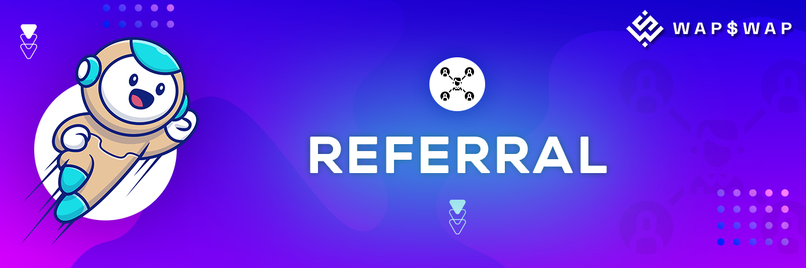

# 👥 Referral

Our platform gives you an opportunity to maximize your rewards. Hence, you can invite your friends to register via the referral link and receive rewards from our referral program. Referral rewards can be received from Farms & Staking pools.

**WAP$WAP referral program will work in the following way:**

* **Farms & Staking pools.** You can expect 5% return from your friends' earnings. Your referral rewards will be visible and directly withdrawn from your wallet address when your invited friends will withdraw WAP tokens to the wallet.


_Let’s say, you invited a friend and he/she earned 5 WAP from either “Farms” or “Staking pools”. As a result, you will receive 5% from 5 WAP, which accounts for 0.25 WAP._


All your referral rewards will be sent to your referral balances in $WAP tokens. All the fees will also be charged in $WAP tokens.

**You will have two separate referral earning counter, including:**

1. Farms referral earnings&#x20;
2. Staking pools referral earnings

With our referral system we want to have both you and your friends benefit from joining our community.
