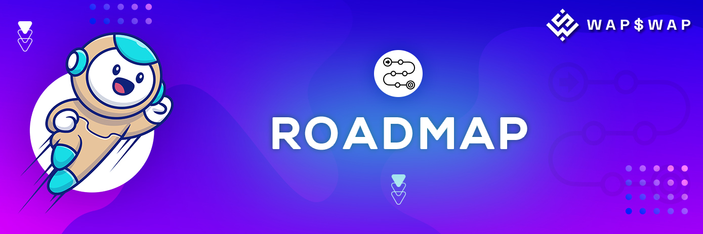

# 🎯 Roadmap

**2020 December** - Inception of the concept.

**2021 January** - Planning and Team Building.

**2021 March** - Beginning of platform development.

**2021 August** - Deployment on Testnet for testing the platform in Alfa and Beta Version.

**2021 September** – Get Audited by Security Partners.

**2021 November** - Launch of WAP$WAP with Swapping, Cross Chain Swapping, Farming & Staking Facilities.

**2021 November** – Aggressive Marketing Campaign launch with Bounty Campaign on BitcoinTalk

**2021 November** – Partnership Announcements with the Financial Institutions & other Defi projects of BSC.

**2021 November** – Listing of decentralized exchanges like PancakeSwap. September 2021 - Locking the Liquidity on immediate basis after public sale.

**2021 December** - New Liquidity pools will be added.

**2021 December** - New cross chain integrations for cross swapping.

**2022 January** - Strategic and Fair Launchpad for new projects.

**2022 February** - Android Wallet and IOS Wallet Development.

to be continued...
