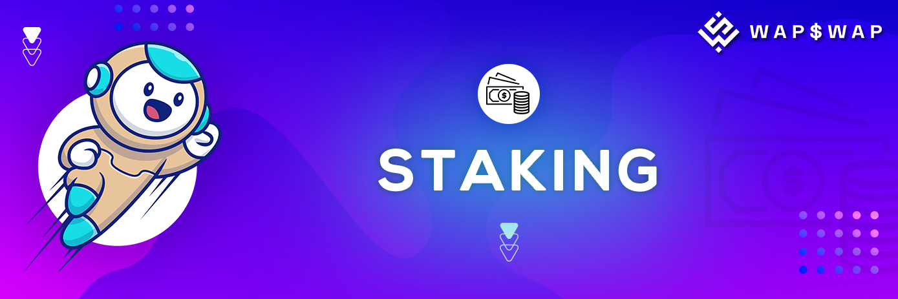

# 💸 Staking

“**$WAP” TOKEN Staking** involves the locking up of assets to participate in the validation of transactions on proof-of-stake blockchains, with a financial “reward” provided in terms Of different Tokens. This offers a digital asset alternative for yield generation in today's low or negative interest rate environment.

## Stake $WAP to earn new tokens. You can unstake at any time. Rewards are calculated per block. 

**Staking Pools:**

* **WAP POOL**
* **BNB POOL**
* **CAKE POOL**

**\*Please note : If you unstake before 168 hours, the rewards will be lapsed and sent to dev address for burning.**
