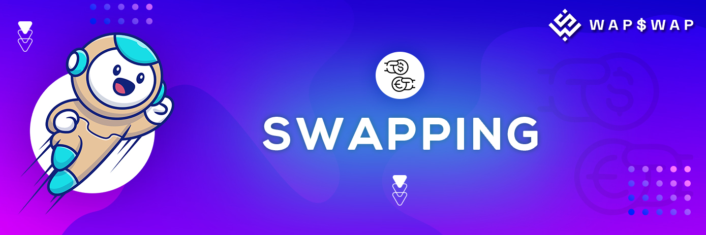

# 💱 Swapping

WAP$WAP uses the [AMM](https://academy.binance.com/en/articles/what-is-an-automated-market-maker-amm) model to create liquidity pools of tokens that users can access to swap. Users don't trade as makers or takers but instead interact with a [smart contract](https://academy.binance.com/en/articles/what-are-smart-contracts). Anyone can start providing liquidity by depositing a pair of coins in equal value.

In return, the liquidity providers receive LP (liquidity pool) tokens that act as a receipt for their share of the pool. These LP tokens are burnt when reclaiming your tokens. You can also provide them to use in yield farming, where your fees are constantly reinvested in the pool to compound your interest.

WAP$WAP’s AMM model rewards liquidity providers with a 0.18% fee shared proportionally based on the [liquidity](https://academy.binance.com/en/articles/liquidity-explained) provided. The tokens' prices aren't determined via an order book but through a formula known as the Constant Product Market Maker.

Let's use the BNB/BUSD liquidity pool as an example. We'll refer to BNB as _**x**_ and BUSD as _**y**_. With a Constant Product Market Maker formula, _**x**_ and _**y**_ are multiplied together to create a constant, _**k**_, that can’t change.

The liquidity pool will offer you a conversion rate, in our case, 300 BUSD (_**y**_) for 1 BNB (_**x**_). When you supply the 300 BUSD to the pool and remove 1 BNB, it will have a higher supply of BUSD and a smaller supply of BNB. This action causes the price of BNB to rise as _**k**_ is constant. In other words, you are using your BUSD to buy BNB. As more BNB leaves the pool, its price in comparison to BUSD rises.

## **Token Swaps** on WAP$WAP are a simple way to trade one BEP-20 token for another via automated liquidity pools. 

The liquidity provided to the exchange comes from Liquidity Providers ("LPs") who stake their tokens in "Pools". In exchange, they get $WAP FLIP ($WAP Liquidity Provider) tokens, which can also be staked to earn $WAP tokens in the "farm".

When you make a token swap (trade) on the exchange you will pay a **0.25% trading fee**, which is broken down as follows:

**0.18%** - Returned to Liquidity Pools in the form of a fee reward for liquidity providers.

**0.02%** - Sent to the WAP$WAP Treasury.

**0.05%** - Sent towards $WAP buyback and burn.
